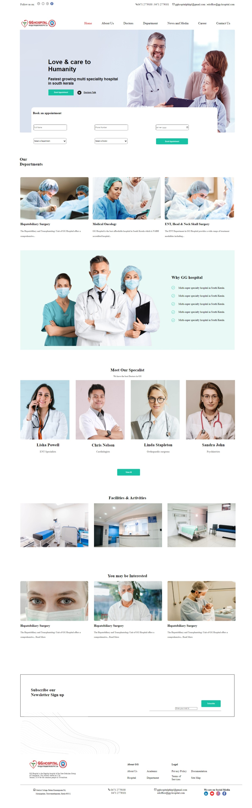

HTML-CSS
GG-Hospital

During the training of HTML and CSS, I designed the home page of GG-Hospital website.The project was done using HTML and CSS in Visual Studio Code.

The page has the following contents included:

Navigation Bar
Book Appointment
Doctors Listed
Departments Listed
Why GG is better section
Facilities and Activities
You May Be Interested In section
Footer
Newsletter

Screenshot of the design:

